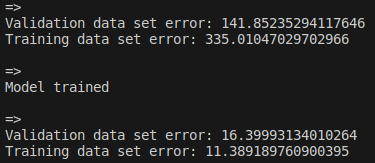

## Description
Multifeature linear regression with,
- Feature scaling
- Vectorized implementation

## Dataset
UCI Machine Learning Repository - Boston Housing

## Model
$w_{1}x_{1}+w_{2}x_{2}+...+w_{13}x_{13}+b$

## Cost
(Not exactly right because of multiple weights but gives a good enough idea)
$$\frac{1}{2m}\sum_{i=1}^{m}(f(x^{(i)})-y^{(i)})^2$$

## Derivatives for gradient descent
### For setting weight $w_j$
$$\frac{1}{m}\sum_{i=1}^{m}(f(x^{(i)})-y^{(i)})x^{(i)}_{j}$$
### Constant $b$
$$\frac{1}{m}\sum_{i=1}^{m}(f(x^{(i)})-y^{(i)})$$

## Output screenshot
